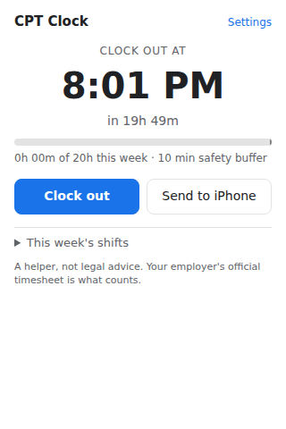

# CPT Clock

A Chrome extension for international students on **CPT**, who can work at most **20 hours a week**
during the academic term. When you clock in, it works out **exactly when to clock out** so you get
the most hours without going over. Then it reminds you on your **Mac** and your **iPhone**.



## What it does

- **Detects clock-in/out** when you click *Check In / Check Out*, *Clock In / Clock Out* or *Punch In / Punch Out*
  on **Workday**, **ADP** or **UKG (Kronos)** in Chrome. A small toast confirms it, with **Undo** in case you cancelled.
- **Manual clock in/out** from the popup, for when you clock in on your phone or a kiosk.
- **Calculates your clock-out time:** `clock-in + (20h − hours already worked this week − safety buffer)`.
  The default buffer is 10 minutes, to cover rounding and slow clock-outs.
- **Mac notifications** 15 min, 5 min and 0 min before clock-out, plus a countdown badge on the toolbar icon.
- **iPhone reminder** through a one-time Apple Shortcut setup. See [shortcuts/README.md](shortcuts/README.md).
- **Edit your shifts** for the week, for forgotten clicks, shifts on other devices, or corrections from your official timesheet.
- Settings: weekly limit, buffer, week start day (Sun/Mon/Sat), reminder times.

Everything stays on your computer (`chrome.storage.local`). Nothing is sent anywhere.

## Install (developer mode)

1. Download this repo (**Code → Download ZIP**, then unzip), or `git clone` it.
2. In Chrome, open `chrome://extensions` and turn on **Developer mode** (top right).
3. Click **Load unpacked** and choose the `cpt-clock` folder.
4. Pin **CPT Clock** to the toolbar using the puzzle-piece icon.
5. On macOS, allow Chrome notifications: **System Settings → Notifications → Google Chrome → Allow**,
   and choose the *Alerts* style so they stay on screen.
6. Optional: set up the [iPhone Shortcut](shortcuts/README.md).

## Limits to know

- The extension only sees clock-ins made **in Chrome** on the supported sites. Clock-ins made anywhere else need the manual button.
- Its weekly total is **its own log**, not your employer's official record. If they differ, fix the shifts in the popup.
- Chrome must be running for Mac notifications. The iPhone reminder works even if it isn't.
- Your employer's timesheet week might start on a different day, and it might be in a different time zone. Check **Settings**.
- Workday/ADP/UKG button labels vary by employer. If a click isn't detected, open an issue with the exact button text.

> **Disclaimer:** CPT Clock is a personal helper, not legal or immigration advice. Your DSO and your
> employer's official time records are what count. Keep a margin.

## Development

```sh
npm test                 # unit tests for the hour math (lib/hours.js)
```

- `lib/hours.js`: pure time calculations (week boundaries, totals, clock-out time)
- `background.js`: session log, alarms, notifications, iPhone hand-off
- `content/detect.js`: clock-in/out button detection on timekeeping sites
- `popup/`, `options/`: UI
- `test-pages/fake-workday.html`: local page for trying detection. Serve it with `python3 -m http.server` and
  add `http://localhost/*` to the content-script `matches` while testing.

## Roadmap

- Read the official weekly total from the Workday timesheet to cross-check
- Native iPhone/Mac app for a real Clock-app alarm
- Chrome Web Store release for other students
